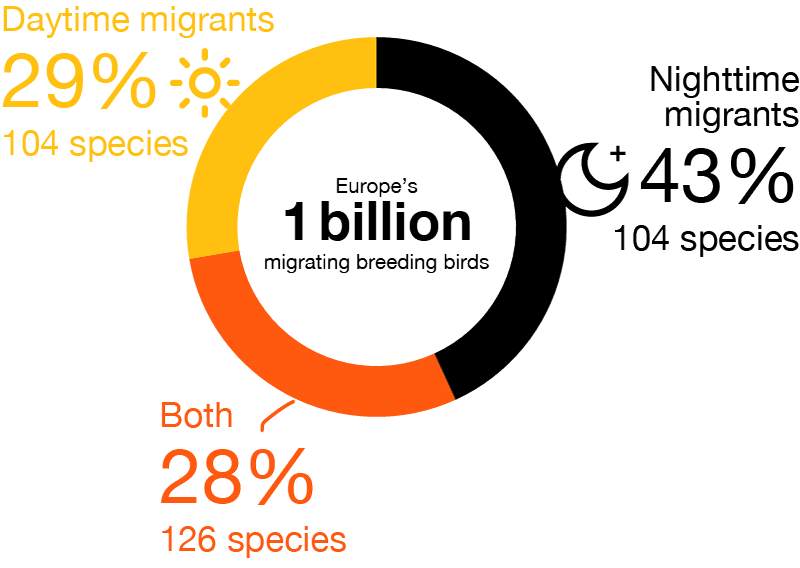

# migrant-nocturnality

Estimating the proportion of European migratory birds that migrate by day vs. by night vs. both.

## Procedure overview

1. **Compile life-history traits.** Start with the dataset of [life-history characteristics for European birds](https://doi.org/10.1111/geb.12709), and retain the columns that identify facultative, short-distance, and long-distance migrants. These are used to flag species as migratory.  
2. **Add population estimates.** Join the life-history table to [population estimates](https://doi.org/10.1098/rstb.2022.0198) from the European bird population dataset (OPS EU28), keeping the latest year per species and reconciling any taxonomic name updates so that datasets align.  
3. **Classify nocturnality.** Manually classify each species as nocturnal, diurnal, or both based on limited literature research and field experience (stored in `species_list_nocturnality.xlsx`).  
4. **Filter to migratory species.** Keep species that are migratory and have a nocturnality classification.
5. **Summarize totals and proportions.** Sum population totals within each migration type (nocturnal, diurnal, both), then compute proportions relative to the overall migratory total.  
6. **Visualize.** Plot the distribution of migratory birds by migration time of day and export the figure to `nocturnality.pdf`.

## Nocturnality classification
Species were classified as nocturnal, diurnal, or both based on a brief literature review and field experience, reflecting their typical migration behaviour. Migration timing can vary with context, and many species show mixed strategies, so these categories are necessarily approximate.

Some misclassification is likely, particularly for less well-studied or less abundant species. However, because estimates are weighted by population size, the overall proportions are driven by common species for which migration timing is relatively well established. As a result, reasonable classification errors are unlikely to substantially affect the aggregate results.

## Data sources
* **Life-history characteristics:** Storchová L, Hořák D. Life-history characteristics of European birds. Global Ecol Biogeogr. 2018; 27: 400–406. [https://doi.org/10.1111/geb.12709](https://doi.org/10.1111/geb.12709)
* **Population estimates:** Richard D. Gregory, Mark A. Eaton, Ian J. Burfield, Philip V. Grice, Christine Howard, Alena Klvaňová, David Noble, Eva Šilarová, Anna Staneva, Philip A. Stephens, Stephen G. Willis, Ian D. Woodward, Fiona Burns; Drivers of the changing abundance of European birds at two spatial scales. Philos Trans R Soc Lond B Biol Sci 17 July 2023; 378 (1881): 20220198. [https://doi.org/10.1098/rstb.2022.0198](https://doi.org/10.1098/rstb.2022.0198)
* **Nocturnality classification:** Manual classification based on literature review and field experience.

## Nocturnality proportions

